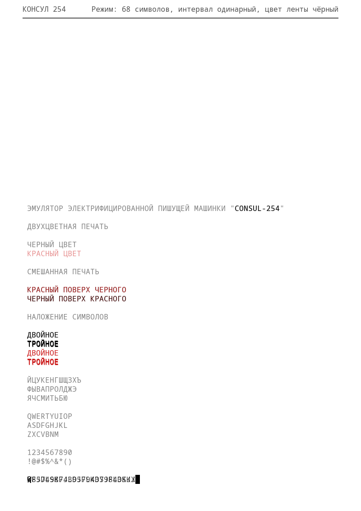

Simple and naive Rust implementation of Consul 254 typewrite (standalone mode).

Allows to type in latin and cyrillic top case letters (original device's charset limitation), numbers and some other symbols.
Supports two colour typing and mixing. Does not save hat you type, text will be lost on close.

Build for Ubuntu, uses iced lib.

1. Start typing from bottom line.
2. Use «Enter» to Line feed and Carriage return, or «Alt»+«Enter» for Carriage return (back to first position).
3. Use double «Alt» tap to change ribbon colour from default black to red and back.
4. Type «Alt»+symbol to type in opposite colour (red for black and back).
5. Use «Left» and «Right» cursor keys to move carret over line.
6. You may type up to three symbols at the same position over existing with colour mixing (gives different colours combinations).
7. «Ctrl»+ «1», «2» or «3» changes line width and number of lines on page.
8. «F1» for simple help.

Space bar just skips space, doesn't remove typed symbols. Or highlights typed symbol at current position (a little fantasy feature, never existed in real device).
