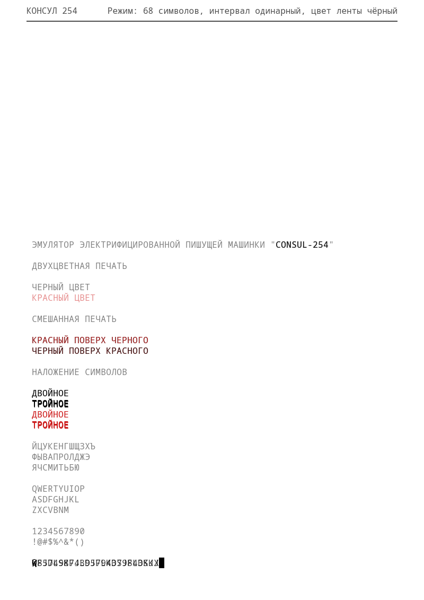

# uConsul254

Simple and naive Rust implementation of the Consul 254 typewriter in standalone mode.

The application is designed for Ubuntu Desktop and uses the `iced` library for its graphical interface.

It supports manual keyboard input as well as text-file playback. A file passed as a command-line argument is processed as a sequence of keystrokes and typewriter commands.


## Features

1. Start typing from the bottom line.
2. Type uppercase Latin and Cyrillic letters, including `Ё`, numbers and supported symbols.
3. Use `Enter` for line feed and carriage return.
4. Use `Alt` + `Enter` for carriage return to the first position of the current line.
5. Use a double `Alt` press to change the ribbon colour from black to red and back.
6. Use `Alt` + a symbol to type that symbol in the opposite ribbon colour.
7. Use `Left` and `Right` cursor keys to move the carriage over already typed text.
8. Type over existing symbols without erasing them.
9. Overlay up to three symbols at the same position.
10. Mix black and red overlays to produce different visual combinations.
11. Use `Ctrl` + `1`, `Ctrl` + `2` or `Ctrl` + `3` to change the line width.
12. Press `F1` to show or hide the built-in help.
13. Load and process a UTF-8 text file at application startup.
14. Move the cursor backwards and forwards while processing a text file.
15. Change the ribbon colour while processing a text file.
16. Clear the printed page from a text file command.


## Building

Install Rust and the required Ubuntu Desktop development libraries.

Build the project in debug mode:

```bash
cargo build
```

Build an optimized release version:

```bash
cargo build --release
```


## Running

Start the application without an input file:

```bash
cargo run --release
```

Start the application and process a text file:

```bash
cargo run --release -- example.txt
```

After building the release version, the application can be started directly:

```bash
./target/release/uConsul-254\_typewriter example.txt
```
The input file must be encoded as UTF-8.

If no file is specified, the application starts with an empty sheet and accepts input from the keyboard.


## Input File Commands

The following commands can be used in an input file:

| Command | Action |
|---|---|
| `{LEFT}` | Move the carriage one position to the left |
| `{RIGHT}` | Move the carriage one position to the right |
| `{ALT_LEFT}` | Move the carriage one position to the left using the `Alt` cursor mode |
| `{ALT_RIGHT}` | Move the carriage one position to the right using the `Alt` cursor mode |
| `{TAPE}` | Change the ribbon colour |
| `{CLEAR}` | Clear the printed page |

Commands are replaced with control sequences before the file is processed.

All other characters are treated as normal typewriter input. Unsupported characters are ignored. Lowercase letters are converted to uppercase, matching the behaviour of manual keyboard input.

Newline characters are supported. Both Unix line endings (LF) and Windows line endings (CRLF) can be used.


## Input File Example

```
CONSUL 254 TYPEWRITER DEMONSTRATION

BLACK TEXT{TAPE}
RED TEXT{TAPE}

BOLD HEADING{LEFT}{LEFT}{LEFT}{LEFT}{LEFT}{LEFT}{LEFT}{LEFT}{LEFT}{LEFT}{LEFT}{LEFT}BOLD HEADING

{TAPE}MIXED COLOUR TEXT{LEFT}{LEFT}{LEFT}{LEFT}{LEFT}{LEFT}{LEFT}{LEFT}{LEFT}{LEFT}{LEFT}{LEFT}{LEFT}{LEFT}{LEFT}{LEFT}{LEFT}{LEFT}MIXED COLOUR TEXT
```

Repeated {LEFT} commands move the carriage over already printed text. Printing again at the same position creates an overlay instead of deleting the original symbol.


## Manual Controls

| Key | Action |
|---|---|
| `A-Z` | Type a Latin letter |
| `А-Я` | Type a Cyrillic letter |
| `0-9` | Type a number |
| `Space` | Type a space |
| `Enter` | Line feed and carriage return |
| `Alt` + `Enter` | Carriage return |
| `Alt` + symbol | Type using the opposite ribbon colour |
| `Alt` twice | Change ribbon colour |
| `Left` | Move the carriage left |
| `Right` | Move the carriage right |
| `Ctrl` + `1` | Select 68-character line mode |
| `Ctrl` + `2` | Select 80-character line mode |
| `Ctrl` + `3` | Select 106-character line mode |
| `F1` | Show or hide help |


## Supported Characters

The typewriter accepts uppercase Cyrillic and Latin characters, numbers and the following symbols:

```
АБВГДЕЁЖЗИЙКЛМНОПРСТУФХЦЧШЩЪЫЬЭЮЯ
ABCDEFGHIJKLMNOPQRSTUVWXYZ
0123456789
.,;:!?-–—_()[]{}<>"'\`@#\$%&*+=/\|~^«»№
```


## Overlay Printing

A character can be printed repeatedly at the same position by moving the carriage backwards and typing again.

Up to three overlays are supported at one position. Further overlays are still displayed, but the visual colour is calculated from the existing layers.

Overlay printing can be used to imitate bold headings:

```
BOLD{LEFT}{LEFT}{LEFT}{LEFT}BOLD
```

Overlaying text with different ribbon colours produces mixed colour combinations.


## Limitations

- The application currently uses a single page.
- Text is not saved automatically when the application closes.
- Input files are processed sequentially during application startup.
- Unsupported characters are ignored.
- The Space key advances the carriage but does not erase previously printed symbols.
- The application does not emulate the mechanical sound or physical limitations of the original device.
- The input-file command syntax is an application extension and was not part of the original Consul 254 typewriter.


## Screenshot


## Changelog

### Version 0.1.0

The initial version of the application provided the basic Consul 254 typewriter interface.

The following features were available:

- Basic graphical typewriter window.
- Manual text input from the keyboard.
- Support for uppercase Latin and Cyrillic characters.
- Support for numbers and punctuation marks.
- Space and `Enter` key handling.
- Carriage return using `Alt` + `Enter`.
- Left and right cursor movement.
- Two ribbon colours: black and red.
- Alternative ribbon colour when using `Alt` together with a character.
- Ribbon colour switching by pressing `Alt` twice.
- Character overlays when typing at an already used position.
- Support for up to three character layers at the same position.
- Three line-width modes:
  - 68 characters;
  - 80 characters;
  - 106 characters.
- Line-width selection using `Ctrl` + `1`, `Ctrl` + `2` and `Ctrl` + `3`.
- Built-in help screen shown with `F1`.
- Visual representation of the paper, margins, carriage and typed characters.
- Standalone operation without network access or external services.

### Version 0.1.10

Compared with version `0.1.0`, the following features and improvements have been added:

- Added support for loading a UTF-8 text file from the command line.
- Added sequential processing of file contents as typewriter input.
- Added support for Unix (`LF`) and Windows (`CRLF`) line endings.
- Added cursor movement over already printed text while processing an input file.
- Added the `{LEFT}` command for moving the carriage one position backwards.
- Added the `{RIGHT}` command for moving the carriage one position forwards.
- Added the `{ALT_LEFT}` command for alternative left-carriage movement.
- Added the `{ALT_RIGHT}` command for alternative right-carriage movement.
- Added the `{TAPE}` command for changing the ribbon colour during file processing.
- Added the `{CLEAR}` command for clearing the printed page.
- Added file commands for creating overlays over existing characters.
- Added support for single, double and triple character overlays.
- Added support for overlaying text with different ribbon colours.
- Added support for imitating bold headings through repeated overlays.
- Added automatic conversion of lowercase letters to uppercase during file processing.
- Added handling of unsupported characters by ignoring them instead of terminating the application.
- Added command-line examples and input-file documentation.
- Added documentation for keyboard controls and input-file commands.
- Fixed the elapsed-time comparison used for detecting a double `Alt` press.
- Improved the built-in help information.
- Documented the supported character set and overlay-printing behaviour.
